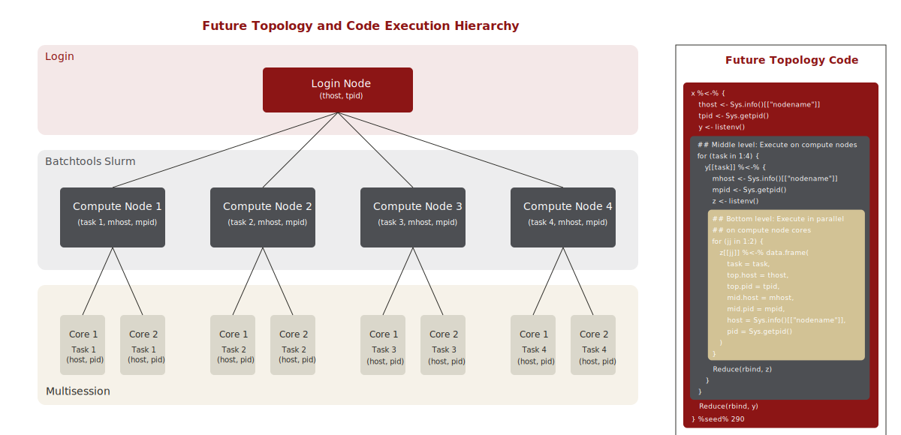

# R Integration with Stanford FarmShare 2

Configuration files and examples for running distributed R computations
using the `future` package ecosystem.

The demonstration uses Stanford's FarmShare 2 cluster system as an example.
You can adapt the scripts to other cluster systems by modifying the SLURM
parameters and login node configuration.

## Files

- `.batchtools.slurm.tmpl`: SLURM template for {batchtools} R package.
- `.bashrc`: Sample `.bashrc` file for loading R module on the cluster during login.
- `future-topology.R`: Sets up nested futures for distributed computation across login node, cluster nodes, and cores
- `future-data-transference.R`: Demonstrates data transfer between local and remote nodes
- `cluster_execution_hierarchy.csv`: Sample output showing execution hierarchy
- `hpc.Rproj`: RStudio project configuration

## Prerequisites

- R installation locally and on the cluster with the following packages:
  - `future`
  - `future.batchtools`
  - `listenv`
- Access to a cluster system
- SSH access configured for the cluster
- R/Rscript installed on the cluster

## Setup

1. Install required R packages locally **and** on the cluster: 
   ```r
   install.packages(c("future", "future.batchtools", "listenv"), repos = "https://cloud.r-project.org")
   ```
2. Create [`.batchtools.slurm.tmpl`](.batchtools.slurm.tmpl) in your home directory:
   ```bash
   wget https://raw.githubusercontent.com/coatless-videos/future-topology-demo/refs/heads/main/.batchtools.slurm.tmpl
   ```
3. Modify the `.bashrc` file to automatically load the R module:
   ```bash
   # Load R 4.4.0
   if command -v module >/dev/null 2>&1; then
       module load r/4.4.0
   fi
   ```

> [!IMPORTANT]
>
> If you are using FarmShare, you will need to modify the `.bashrc` further
> by adding the following lines at the top of the file:
>
> ```bash
> # Initialize Lmod
> if [ -f /software/spack/opt/spack/linux-ubuntu22.04-x86_64_v3/gcc-12.3.0/lmod-8.7.24-zo2r3he7kqr2ohenyvha5mmsxh7t3x54/lmod/lmod/init/bash ]; then
>     source /software/spack/opt/spack/linux-ubuntu22.04-x86_64_v3/gcc-12.3.0/lmod-8.7.24-zo2r3he7kqr2ohenyvha5mmsxh7t3x54/lmod/lmod/init/bash
> fi
>
> # Set MODULEPATH
> export MODULEPATH=/software/modules/linux-ubuntu22.04-x86_64/openblas/0.3.26-oej3zvl/Core:/software/modules/linux-ubuntu22.04-x86_64/Core:/software/modules/commercial
> ```
   
4. Open the project in RStudio using `hpc.Rproj`
5. Modify the login node configuration in the scripts to match your cluster location 
   or Stanford credentials:
   ```r
   login <- tweak(cluster, workers = "your_sunetid@login.farmshare.stanford.edu",
                  persistent = TRUE)
   ```
   
## Usage

The repository provides two main examples: 1. Distributed Computation and 2. Data Transfer

### Distributed Computation

Run `future-topology.R` to see how to:

- Connect to the login node
- Configure SLURM parameters
- Set up nested futures for distributed computing
- Monitor job execution
- Collect and save results



### SLURM Configuration

This script uses the following SLURM parameters:

```R
resources = list(
  n_cpu = 2,             # Number of cores
  queue = "normal",      # Queue name
  walltime = "00:01:00", # Walltime or time limit
  mem = "4G"             # Memory limit
)
```

Modify these parameters to match your job requirements.

### Data Transfer

Run `future-data-transference.R` to learn how to:

- Transfer data between local and remote nodes
- Save and read files on the cluster
- Verify file operations

> [!NOTE]
> 
> It's recommended to use `scp`, `rsync`, or `sftp` for large data transfers
> rather than {future}'s data transfer mechanisms.

## Best Practices

- Always clean up your sessions using `plan(sequential)` when done
- Monitor your cluster usage and adhere to Stanford FarmShare 2 usage policies
